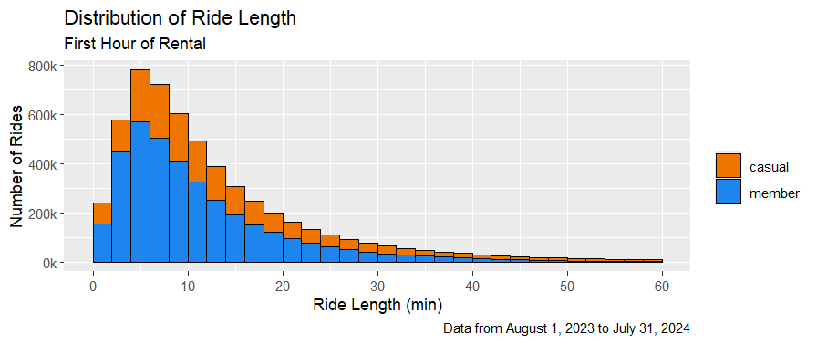
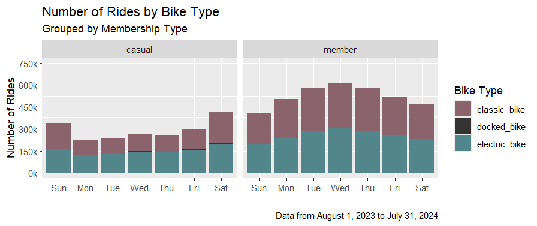

# Cyclistic Bike Share: Analyzing Riders Behavior to Optimize Membership

> [!NOTE]
> This project deals with the Cyclistic bike-share analysis case study developed by Google for the [Google Data Analytics Professional Certificate](https://www.coursera.org/professional-certificates/google-data-analytics) program.

&#x25B6; *Click [here](#conclusions-data-story-and-visualizations) to jump directly to the [Conclusions (data story & viz)](#conclusions-data-story-and-visualizations) section.*

## Introduction

Cyclistic, a fictional bike-sharing company, aims to increase its annual membership base. To achieve this, they need to **understand the differences between their casual riders** (pay-per-ride) **and annual members**. This case study is about analyzing rider data to identify patterns and trends. The insights gained will inform a new marketing strategy to convert casual riders into annual members, ultimately driving company growth and profitability.

### Problem to be solved

The goal of the analysis is to find the answer to the question assigned (see below) and provide recommendations that stakeholders can use in the future marketing campaign to convert casual riders into annual members.

> [!IMPORTANT]  
> **Question assigned**: How do annual members and casual riders use Cyclistic bikes differently?

## Data analysis process

### Business task

Distinguishing features between two groups of riders: casual riders and annual members, as well as common features in these groups.

### Data source

**Data source**: Publicly available data from a bike-sharing company\
**Accessed on**: August 8, 2024\
**License**: Non-exclusive, royalty-free, limited, perpetual, as per [Data License Agreement](https://divvybikes.com/data-license-agreement)\
**URL**: [Link to the data source](https://divvybikes.com/system-data)

The data comes from a single second-party source, is stored in the cloud (AWS), and provided “as is,” with no warranty. Data can be used for non-commercial analysis purposes. Data is stored in CSV files organized in .zip folders with five naming conventions for a specific time period.

Data from August 2023 to July 2024 were used for analysis purposes.

### Data-cleaning

Data cleaning and analysis were done exclusively in R due to the BigQuery Sandbox (SQL) and Google Sheets limitations—the data was too large to import.

- Data was confirmed to be reliable, original, comprehensive, current, and cited (ROCCC).
- Rows with trips with a length (`ride_length`) less than zero were removed from the dataset—**removed 404 rows**.
- All data types were correctly typecast and the formats were aligned right after import. All date formats were consistent.
- All column names were meaningful and clean.
- A sample of station names were checked and they were spelled correctly.
- No truncated data were found.
- Duplicates were found and removed based on `ride_id`—**removed 211 rows**.
- Rows with trips longer than 24 hours (1 day) were also removed from the dataset. The bike is considered lost or stolen after 24-hour period according to [this information](https://help.divvybikes.com/hc/en-us/articles/360033484791-What-if-I-keep-a-bike-out-too-long)—**removed 7958 rows** (148 with non-blank `end_station_id`).

In total: 8573 rows were removed from 5,715,693.\
**5,707,120** rows left.

For more information on data manipulation, see the [changelog file](r-files/Changelog.txt).

### Analysis

Data was aggregated and organized into a large `tibble` during the data-cleaning process. If the analysis required data for each month, it was done with grouping and filtering to get the right amount of data for calculations.

The summary of the analysis:

- Analysis period: from August 1, 2023 to July 31, 2024
- Total rides: **5,707,120**:
    - 5,564,497 rides shorter than 1 hour—97.50%
- Average ride length throughout a year: **15 min 30 sec**
- Average ride length for each membership type throughout a year:
    - casual: **21 min 16 sec**
    - member: **12 min 19 sec**
- The least popular months—winter months (fewer and shorter rides):
    - **January** 2024 (144,524 rides)
    - February 2024 (222,791 rides)
    - December 2023 (223,800 rides)
- The most popular months—summer months (more and longer rides):
    - **August** 2023 (770,477 rides)
    - July 2024 (747,662 rides)
    - June 2024 (709,553 rides)
- The most popular day of the week: **Saturday** (among all months and membership types)
- The most popular bike type:
    - casual: electric bike
    - member: classic bike
- The most popular start stations are:
    - casual: near tourists destinations in Chicago, IL, e.g. Navy Pier, Lincoln (Abraham) Park
    - member: near transport hubs or Old Town Triangle in Chicago, IL

### Conclusions (data story and visualizations)

The analyzed data tells about the differences and habits among two groups of users of the bike rental system. The total number of rides was more than 5.7 million, with more than 5.5 million rides lasting less than 1 hour.

Members and casual riders ride on different days of the week, although both groups enjoy riding the most during the summer months. The average ride length for members is 1.7 times less than the average ride length for casual riders. Among all riders, Saturday is the most popular day for a bike ride.

When it comes to the bike type, casual riders mainly use electric bikes with a slight advantage over classic bikes, more visible on weekdays, although casual riders ride much more on weekends. Members, on the other hand, mainly use classic bikes and ride mostly on weekdays.

The data clearly shows that members and casual riders tend to start from different stations. Casual riders prefer start stations near tourist destinations, while members favor locations near transportation hubs and popular neighborhoods.

> [!NOTE]
> A hypothesis can be made that members use bike rental system for commuting, e.g., to school, work, however, casual riders mostly use the system to travel from popular tourist destinations in the city to other places (recreational purposes). Tourists are likely responsible for this part of the traffic.

### Recommendations

1. Encourage the casual riders to travel on weekdays (until Friday late afternoon) by reducing the prices for new members for a certain period of time, e.g., 1–3 months.
2. Add a time-limited promotion for new members: for 60 minutes of riding on weekdays (total), 20 minutes on riding on the weekend for free!
3. Run the promotion during the winter months (December–February) for new members: for 3 rides on weekdays, 1 ride (max. 45 min.) free to use on any day!
4. *Additional one*: Differentiate rental prices according to the type of bike, if they are not already, to encourage the use of classic bike among casual riders.
 
Informing about offers via e-mail/SMS, target group: casual riders. For broader audience use webpages, fanpages, information on bikes, stations, etc.

---

*For a more detailed report, please [contact me](https://github.com/aokolowicz).*